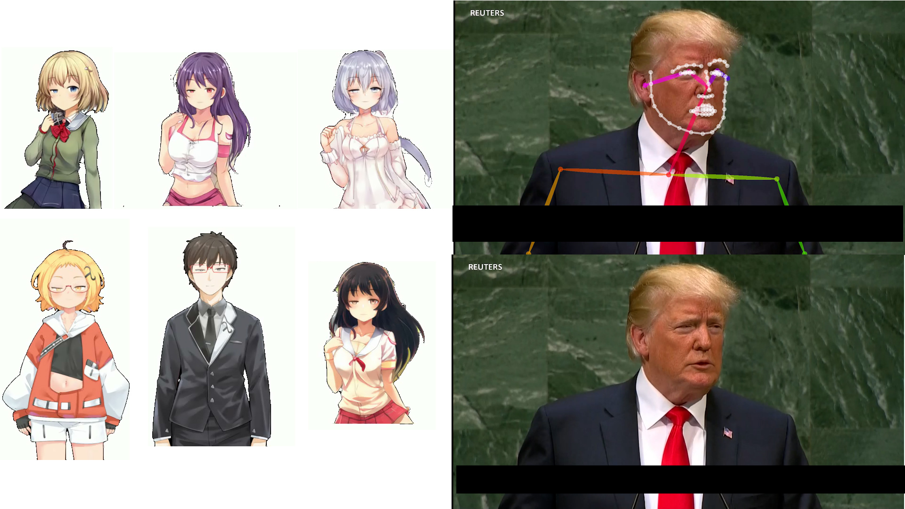
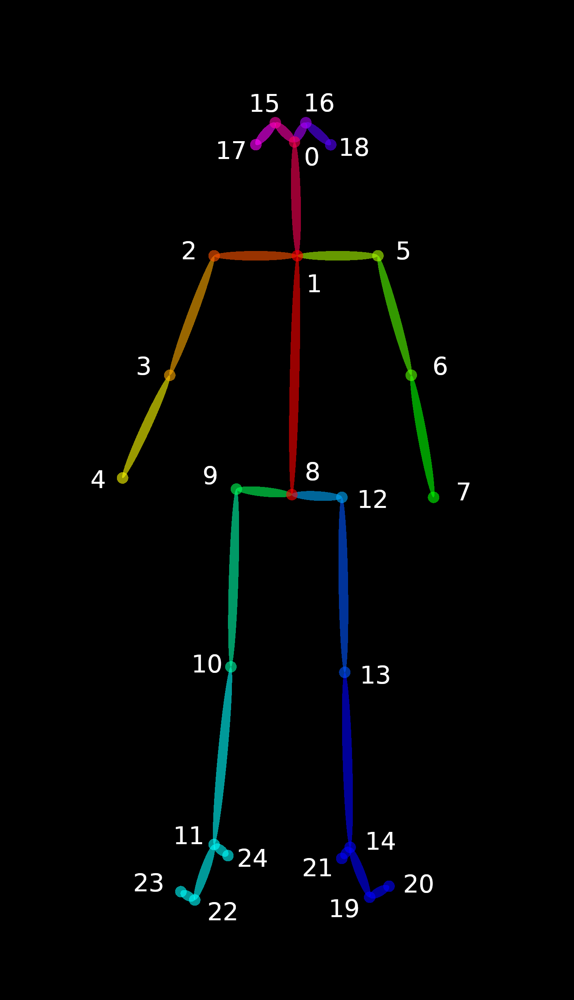
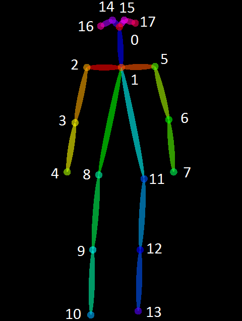
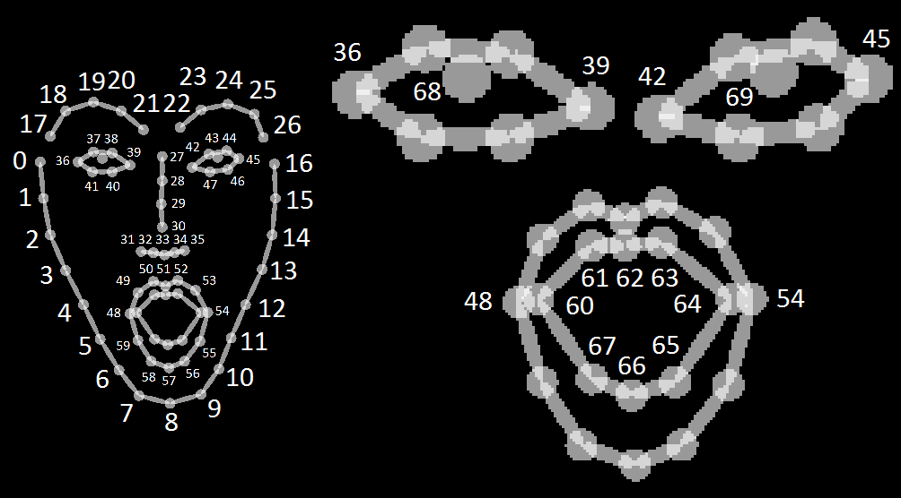
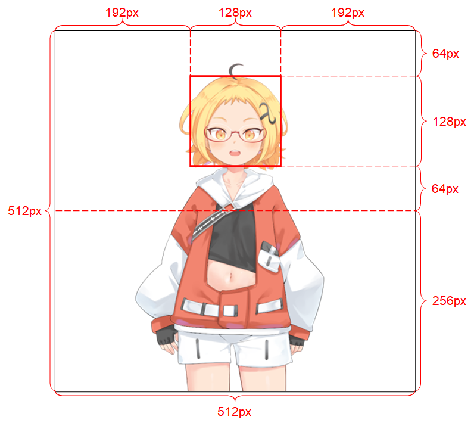
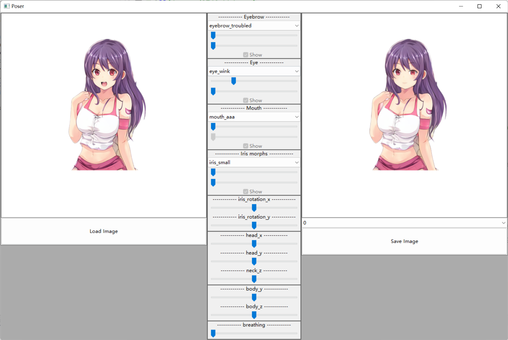

# 纸片人模仿视频人脸
> 本项目基于openpose的脸部追踪，然后只提供二次元人物的图片，即可实现让图片的人物模仿视频里的人说话
> 
> 因为项目主要还是以娱乐为主，所以效果非常差，这后面其实还是有非常多的优化空间的，理论上可以做到非常还原，我懒得优化，感兴趣的可以自行优化算法
## 视频文章
[B站](https://www.bilibili.com/video/BV1wG411J7cg)<br>
[YouTube](https://youtu.be/KKBBNL_fT3g)<br>
[掘金](https://juejin.cn/post/7153798545949556767)
## 效果展示



## 项目运行
### 姿态信息生成
先自己到[openpose](https://github.com/CMU-Perceptual-Computing-Lab/openpose/releases)仓库下载最新的版本（zip文件）

下载后解压，然后使用下面的命令来生成姿态信息
- `--video` 是原始视频信息
- `--face`表示开启脸部检测
- `--write_json`表示生成的json文件地址
- `--write_video`表示检测后的视频
```shell
bin\OpenPoseDemo.exe --video test.mp4 --face --write_json _json --write_video _out.avi
```
生成完毕后可以到`_json`目录下看到每一帧都有一个json文件，这里我随意打开一个内容如下
```json
{"version":1.3,"people":[{"person_id":[-1],"pose_keypoints_2d":[1077.72,365.591,0.774628,921.742,739.205,0.396534,453.756,715.725,0.341301,318.419,1074.83,0.162522,0,0,0,1374.95,753.972,0.375574,1489.81,1074.86,0.0735674,0,0,0,0,0,0,0,0,0,0,0,0,0,0,0,0,0,0,0,0,0,0,0,0,998.16,300.757,0.772213,1118.99,297.813,0.848977,812.821,359.63,0.820732,0,0,0,0,0,0,0,0,0,0,0,0,0,0,0,0,0,0,0,0,0],"face_keypoints_2d":[834.826,304.785,0.625646,834.826,355.756,0.743808,841.197,405.134,0.760711,852.347,449.734,0.678752,881.018,489.555,0.707039,917.654,521.412,0.75636,959.068,540.526,0.689126,1008.45,558.047,0.732456,1059.42,561.233,0.763171,1097.64,558.047,0.787541,1124.72,530.969,0.805633,1142.24,495.926,0.770223,1148.62,460.884,0.785682,1148.62,424.249,0.79813,1151.8,390.799,0.809093,1153.39,354.164,0.766353,1153.39,323.9,0.702541,927.211,300.007,0.546061,954.289,282.486,0.702503,986.146,276.114,0.774053,1021.19,272.929,0.835793,1051.45,277.707,0.794673,1086.49,268.15,0.747422,1108.79,253.815,0.771695,1129.5,250.629,0.749803,1150.21,255.407,0.794928,1162.95,277.707,0.787085,1072.16,303.193,0.88876,1075.34,328.678,0.846502,1083.31,354.164,0.86126,1086.49,379.649,0.896768,1040.3,405.134,0.880551,1059.42,406.727,0.940069,1073.75,409.913,0.877018,1086.49,406.727,0.908582,1097.64,403.542,0.853876,960.66,309.564,0.824689,984.553,303.193,0.864511,1002.07,303.193,0.817122,1021.19,304.785,0.858607,1002.07,306.378,0.861647,982.96,307.971,0.842491,1097.64,306.378,0.868936,1111.98,303.193,0.981197,1124.72,304.785,0.951481,1137.47,312.75,0.945184,1124.72,314.343,0.906095,1111.98,311.157,0.899284,1008.45,467.255,0.849859,1035.52,456.105,0.905398,1059.42,444.955,0.87552,1072.16,449.734,0.883174,1084.9,444.955,0.914631,1097.64,454.513,0.876544,1108.79,467.255,0.855011,1097.64,473.627,0.862751,1084.9,479.998,0.908944,1072.16,479.998,0.908779,1056.23,479.998,0.817922,1033.93,472.034,0.829224,1019.6,467.255,0.821602,1057.82,459.291,0.831205,1072.16,460.884,0.890558,1084.9,459.291,0.911839,1099.24,465.662,0.868094,1084.9,459.291,0.919735,1072.16,460.884,0.90252,1057.82,459.291,0.837281,990.924,303.193,0.812471,1118.35,304.785,0.848079],"hand_left_keypoints_2d":[],"hand_right_keypoints_2d":[],"pose_keypoints_3d":[],"face_keypoints_3d":[],"hand_left_keypoints_3d":[],"hand_right_keypoints_3d":[]}]}
```

这里简单介绍一下（更详细的可以去看[官方文档](https://cmu-perceptual-computing-lab.github.io/openpose/web/html/doc/md_doc_02_output.html)）

它这个坐标是按照 x0,y0,c0,x1,y1,c1,.... 这样的顺序来的，所以我们每三个点可以提取出一个坐标，然后姿态的点位示意图如下：

 BODY_25格式



COCO格式



人脸的示意图如下



有了这几个点，我们就可以知道脸部的各种姿态了。下面我们就是需要把姿态信息给映射到动漫人脸上

### 动漫人脸映射

我使用的是[talking-head-anime-3](https://github.com/pkhungurn/talking-head-anime-3-demo) 项目，这个项目可以只通过一张图片就能对人物的各个姿态进行控制

当然这个图片有下面的要求
- It should be of resolution 512 x 512. (If the demo programs receives an input image of any other size, they will resize the image to this resolution and also outptu at this resolution.)
- It must have an alpha channel.
- It must contain only one humanoid character.
- The character should be standing upright and facing forward.
- The character's hands should be below and far from the head.
- The head of the character should roughly be contained in the 128 x 128 box in the middle of the top half of the image.
- The alpha channels of all pixels that do not belong to the character (i.e., background pixels) must be 0.

而且图片的比例最好要满足下面的要求，如果不满足的话效果会非常差。所以我基本上也是直接使用官方提供的照片来合成的，自己没找到很合适的图片


这个项目自带一个界面，我们可以通过这个界面来进行各种直观的控制，可以对眉毛、眼睛、嘴巴、头、身体的各个部分控制，非常的强大


如果要运行项目首先下载作者提供的模型[下载地址](https://www.dropbox.com/s/y7b8jl4n2euv8xe/talking-head-anime-3-models.zip?dl=0)并放到data目录下

然后使用下面的命令来启动这个界面
```shell
pip install -r requirements.txt
python tha3\app\manual_poser.py
```

这个项目的各个部分调节是可以通过设置参数来控制的，所以我的唯一工作就是把openpose的内容转换为各个参数，因为我比较菜，想到的就是通过各个点之间的距离来判断各个参数的大小

我写的代码都在`face.py`里面，里面加了一些注释，大家可以简单参考一下

这里我们可以先把所有的姿态文件都放到`all`下面，然后自己修改python文件里面的动漫人物的图片路径，使用下面的命令运行即可,转换完毕后会输出为`res.avi`的视频文件
```shell
python face.py
```


